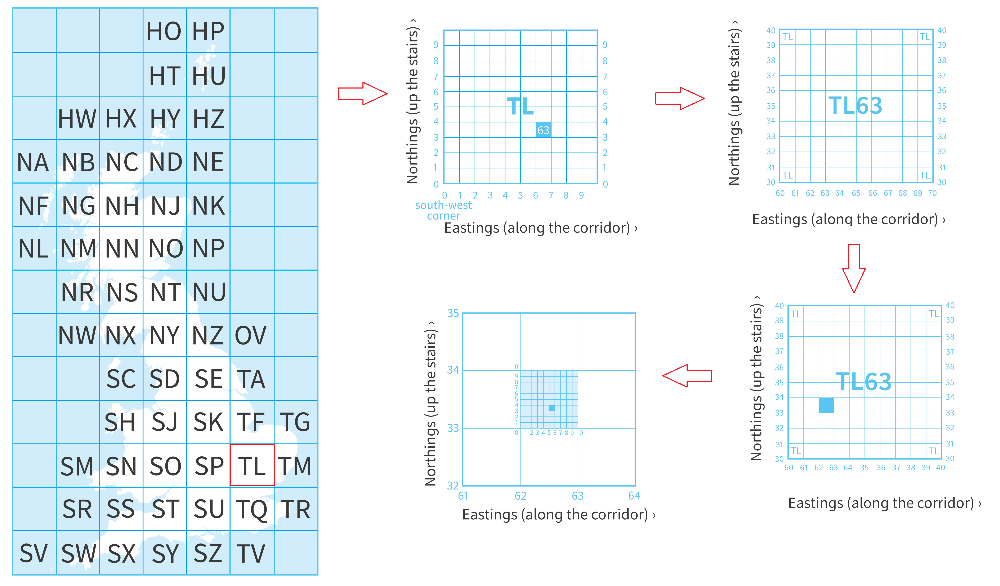
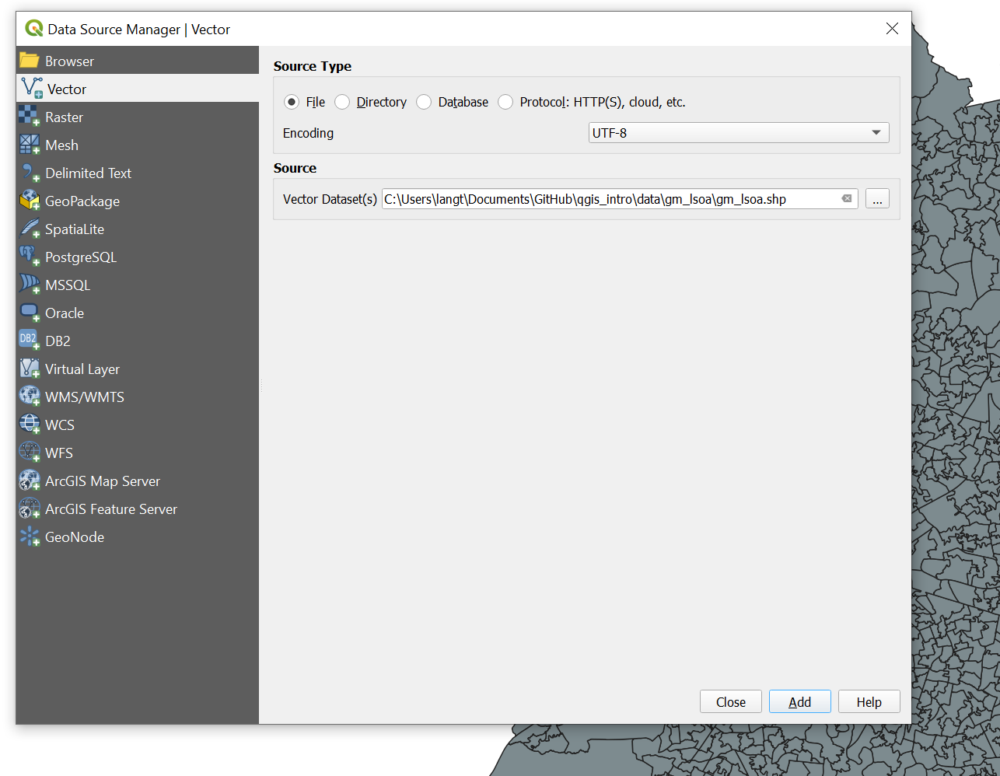
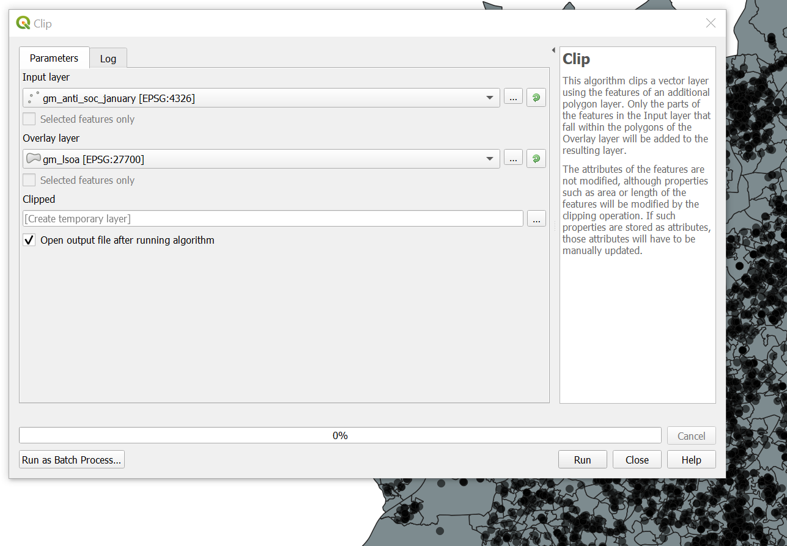
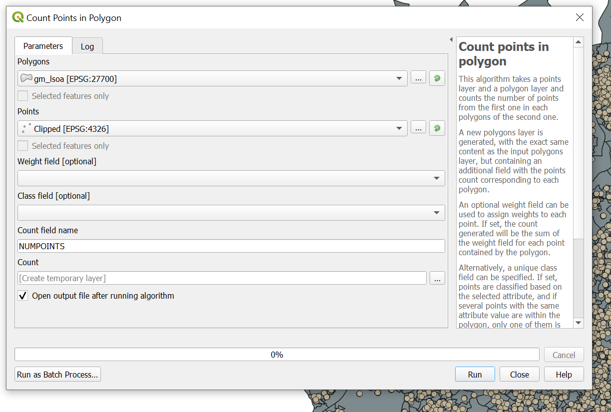
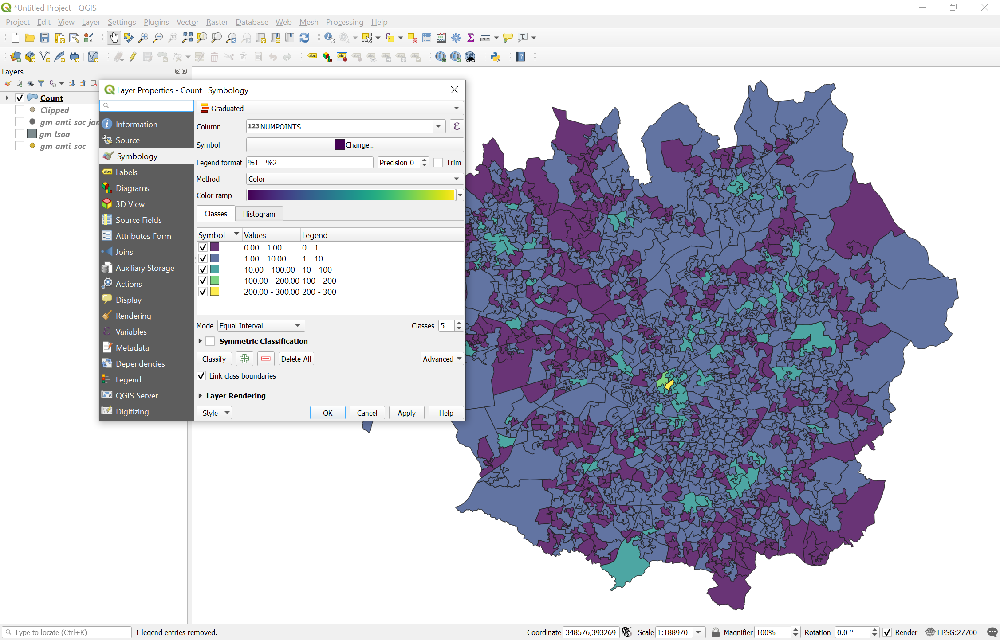
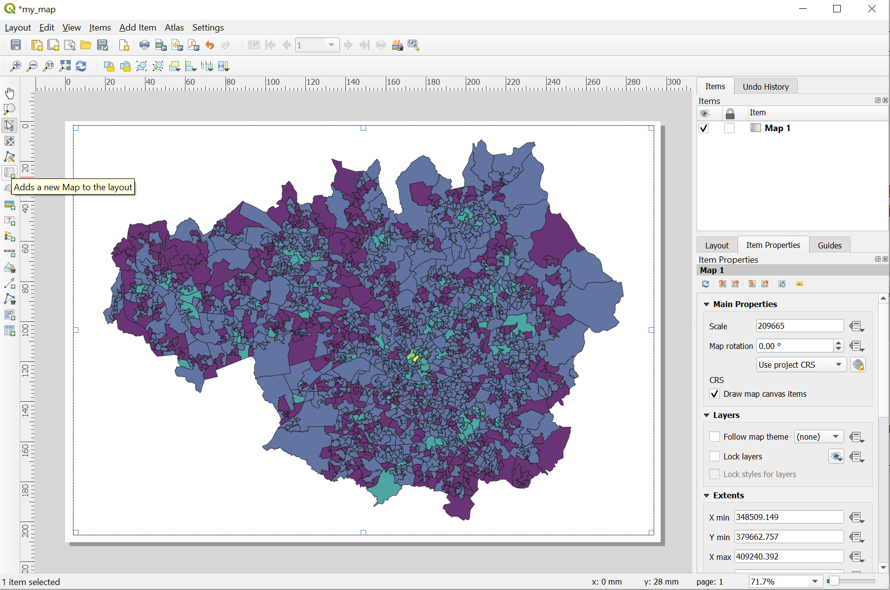
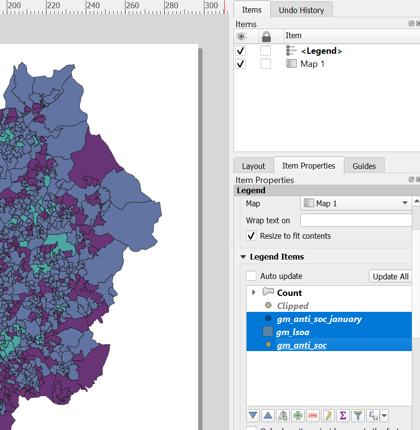
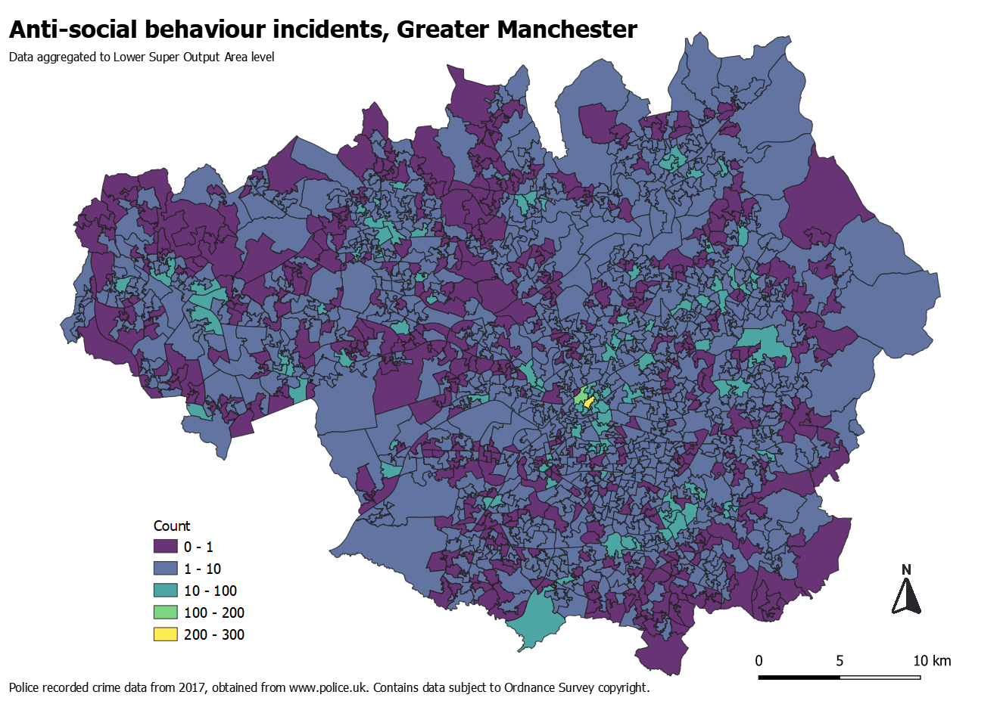

```{r setup, include=FALSE}
knitr::opts_chunk$set(echo = TRUE)
```

# Preamble

This worksheet contains material for an introductory QGIS course held at the [Cathie Marsh Institute for Social Research](https://www.cmi.manchester.ac.uk/) on 26 February 2020. All material is available on [GitHub](https://github.com/langtonhugh/qgis_intro).

# Background

The aim of this short course is to get you started using QGIS as a tool for creating, manipulating, exploring and visualising spatial data. As we will see, QGIS is a powerful piece of software for generating aesthetically pleasing maps, but it is also invaluable for conducting analysis and substantive exploratory research. The material we cover today will equip you with the skills necessary to begin visualising and analysing your own data. Once you're comfortable with the skills introduced in this worksheet, please feel free to put these into practice using your own data, or data downloaded from the data resources section of this worksheet.

You can consider today to be somewhat of a 'crash course' in QGIS. As such, it's worthwhile remembering that the materials we cover today form part of a much wider field commonly known as 'Geographic Information Science' (GIS). If you are interested in exploring this field more, there are some recommended books in the further reading section at the bottom of this page. That said, the information provided in this course will provide you with more than enough information get started exploring spatial data and making maps.

# Why use QGIS?

QGIS is an open-source piece of software. This means, for one thing, that it is free, which represents a significant advantage over comparable software like [ArcGIS](https://www.arcgis.com/index.html) for students and institutions (understandably) unwilling to fork out for licence fees. But that's just a practical advantage: open-source also means transparency, continuous development and a supportive community of developers and users. QGIS is a key part of a wider, growing movement towards open-source software in geospatial analysis, with tools like [GeoDa](https://geodacenter.github.io/) and [GIS functionality in R](https://geocompr.robinlovelace.net/intro.html) becoming increasingly popular too. A key benefit of QGIS being open-source is that it is constantly evolving, with lots of smart people continuously contributing to new versions and plug-ins to expand its capability.

```{r, echo=FALSE, out.width = "600px", fig.align= "center", fig.cap="QGIS is part of a wider open-soure movement."}

```

<br>

You will also find a wealth of documentation and [resources](https://docs.qgis.org/3.4/en/docs/training_manual/introduction/intro.html) online, largely generated by the developers and users themselves. Websites like [StackExchange](https://stackexchange.com/) are full of people willing to answer your questions, and I guarantee you that most queries you have will have already been answered somewhere! To date, nearly [thirsty thousand questions](https://gis.stackexchange.com/questions/tagged/qgis) have asked about QGIS. The friendly online [community](https://www.qgis.org/en/site/forusers/support.html) of QGIS developers and users is possibly the most extensive resource out there!

# Spatial data

Before we get to grips with the software itself, let's cover some preliminary basics, beginning with spatial data types. The diversity of topics in geographical research has motivated the collection of an enormous array of information which can be quantified for use in software like QGIS. Data collected for making maps will inherently include some spatial component, describing the location of an entity in space. It might also incorporate attribute data: non-spatial characteristics which describe entities. There are numerous ways in which spatial data can be stored and used in GIS software, including QGIS, but the most common data types are _vector_ and _raster_.

### Vector data

Vector data represent features in the real world through points, lines and polygons. Standing
on top of a skyscraper, overlooking a city, one will observe buildings, parks, street lights and
roads, each comprising discrete features of the urban landscape. Vector data is comprised of
vertices, which define the geometry of these features. The simplest geometric form is a two-dimensional vertex, a single X (longitude) and Y (latitude) coordinate describing a specific
point location. When vertices are connected in order, with different start and end points, a line
is formed. Lines with equal start and end points, with at least three vertices, represent polygons.
In our urban landscape, points might be used to represent street lights, lines to represent roads,
and polygons to represent buildings. A great deal of spatial data defines objects which do not physically exist on the ground, such as electoral wards or neighbourhood boundaries. Through points, lines and polygons we can collectively describe objects in space, and the attributes which describe these objects. Given its popularity in social science research, we will focus on vector data throughout today.

```{r, echo=FALSE, out.width = "600px", fig.align= "center", fig.cap="Vector data. Source: [Data Carpentry](https://datacarpentry.org/organization-geospatial/02-intro-vector-data/) via the National Ecological Observatory Network (NEON)."}
knitr::include_graphics("img/vector_data.png")
```

<br>

### Raster data

In some circumstances, vector data is unsuitable. Looking down from our skyscraper,
one might also observe variation in air pollution across the city. This cannot easily or intuitively
be represented using vector geometries such as lines or polygons. Air pollution might vary
considerably within streets or parks, and consequently, attribute data associated with lines or
polygons would mask a great deal of information. In such circumstances, raster data may be
able to represent the real world more accurately than vector data. Rasters are comprised of a
regular grid of cells, each of which contain associated attribute data, and can be used to
represent continuous spatial information such as air pollution or remote sensing imagery of the
Earth’s surface. The most common usage of raster data you might have come across are in meteorological maps, such as those used in weather reports. Data about regionwide precipitation or temperature, for instance, is often stored in raster format. As noted earlier, today we are going to focus on vector data, but if you'd like to explore raster data examples, please feel free to explore the raster-specific resources at the end of this worksheet, or give me a shout!

# Projections

## Representing earth

As we noted earlier, maps are representations of the real world. Importantly, these representations tend to be created on a flat surface (a computer screen or piece of paper) even though the earth itself is more-or-less spherical. In an attempt to portray spatial entities, whether it be crime locations or any other phenomena, on a flat surface, we perform a transformation known as a ‘projection’. This is quite the mathematical challenge, and can be carried out in countless different ways, each of which have their own advantages and disadvantages. For instance, until recently, Google Maps used a projection known as the Mercator projection, which whilst useful for navigational purposes, also distorts the earth in a manner which makes land masses near the equator, such as Africa, appear much smaller than they actually are, and land masses near the poles, such as Greenland, much larger. For a light-hearted look at different projections of the world map, I recommend [this blog post](https://brilliantmaps.com/xkcd/).

<br>

```{r, echo=FALSE, out.width="600px", fig.align="center", fig.cap="Source: [Brilliant Maps](https://brilliantmaps.com/xkcd/)."}

```

<br>

## Coordinate Reference Systems

When working within GIS software like QGIS, we are subject to the same restrictions, since we are representing real-world information on a flat computer screen. Any spatial information you are using in QGIS, whether it be tram stop locations, neighbourhood boundaries or river formations, must have an associated **Coordinate Reference System (CRS)**. This ensures that we know how our 2D projected maps relate to the actual features on our (pretty much) spherical earth. You are probably vaguely familiar with the most common type of CRS already, although perhaps not by name, known as a Geographic Coordinate Reference System, because it uses latitude and longitude coordinates to define specific points on the earth's surface. It is more formally known as [WGS 84](https://link.springer.com/chapter/10.1007/978-3-662-03714-0_1). You might have even noticed that when you select a point in Google Maps, it automatically brings up the latitude and longitude coordinates of that location in a white box at the bottom of the window. It is through this system that we can relate my point-and-click to a real place on earth.

<br>

```{r, echo=FALSE, out.width="600px", fig.align="center", fig.cap="An example of latitude and longitude coordinates on the Google Maps online platform."}

```

<br>

As we'll find out later today, not all data you have collected or downloaded will use latitude and longitude coordinates. For example, lots of data released in Britain uses a projected CRS called the [British National Grid](BNG), which uses Eastings and Northings to define locations in the British Isles based on a [grid system](https://getoutside.ordnancesurvey.co.uk/guides/beginners-guide-to-grid-references/), rather than longitude and latitude. It has some advantages, such as preserving shapes, and one can accurately calculate direction using the BNG. In fact, many areas of the world have their [own projected CRS](https://desktop.arcgis.com/en/arcmap/10.3/guide-books/map-projections/pdf/projected_coordinate_systems.pdf) for similar reasons. It is beyond the scope of this course (and indeed, many GIS users) to discuss the merits and shortcomings of different CRS in detail. However, it is important to be aware of the CRS associated with your data, and to ensure that you are using the most appropriate one. Doing so will ensure that you are displaying information accurately, especially when overlaying multiple data sources. We went through this practically during the live demonstration of QGIS, but it will be covered again during the exercises later in this worksheet, using both WSG 84 and the BNG.

If you want to read more about projections and CRS, you can read the excellent QGIS documentation [online](https://docs.qgis.org/testing/en/docs/gentle_gis_introduction/coordinate_reference_systems.html). There are also some useful resources made available by [Data Carpentry](https://datacarpentry.org/organization-geospatial/03-crs/). Alternatively, please feel free to ask me!

<br>

```{r, echo=FALSE, out.width="700px", fig.align="center", fig.cap="British National Grid nested grids. Souce: [Ordnance Survey](https://getoutside.ordnancesurvey.co.uk/guides/beginners-guide-to-grid-references/)."}

```

<br>

Now we are familiar with some GIS fundamentals, we can move on to opening up QGIS and exploring the interface.

# QGIS interface

## Quick tour

For these tutorials we will be using QGIS version 3.6.3 in order to match what is in the computer lab. If you are using your own laptop, you might have a different version, but it shouldn't make too much difference. All previous releases of QGIS can be downloaded retrospectively from their [website](https://qgis.org/downloads/) if you want the exact same version.

```{r, echo=FALSE, out.width="800px", fig.align="center", fig.cap = "Basic QGIS interface."}

```

<br>

When you start-up QGIS, an interface resembling the above screenshot should open. There might be slight differences depending on whether someone has used QGIS on your laptop or computer before. The main window is the **map view** which visualises any spatial data you create or load into the software, so for now, it's completely blank. On the left you will have the **layers** window, which provides a summary of the different "layers" of spatial data you are using. As we saw earlier, one of the most useful functions of QGIS is the ability to overlay different spatial data sources from the same area on top of one another. This window can be used to deselect layers, and change things like transparency to aid exploration of multiple layers simultaneously. At the top of the interface are the various **tools** available. Some of these have dedicated tab icons, but most functionality is available through the drop-down menus which we'll explore later. The bottom of the interface includes live information about your map view, and importantly tells you what **CRS** is currently being used. In this case, our default is EPSG 4326 which is the [official registry code](http://www.epsg.org/) for WGS 84, introduced above.

## Plug-ins

A key benefit of open-source software like QGIS is the continuous development to functionality. One way in which QGIS benefits from this is through [plug-ins](https://plugins.qgis.org/) which can be installed directly from within the software. Plug-ins have largely been developed by the QGIS community, and for that reason, they are often updated frequently with new tools and options. Before we get going with some data, we are going to install a plug-in called [QuickMapServices](https://github.com/nextgis/quickmapservices) which allows you to overlay [Open Street Map](https://www.openstreetmap.org/#map=6/54.910/-3.432) base maps to your visualisations. First, navigate to the Plug-ins installation menu via the drop-down menu, search for the plug-in and install it, as demonstrated below.

```{r, echo=FALSE, out.width="800px", fig.align="center", fig.cap = "<br> Step 1: Find the 'Manage and Install' option from the _Plug-ins_ drop-down menu"}

```

<br>

```{r, echo=FALSE, out.width="800px", fig.align="center", fig.cap = "<br> Step 2: Search for Quick Map Services and click 'Install Plugin'."}
knitr::include_graphics("img/plug2.png")
```

The plug-in will now become available under the 'Web' drop-down menu. Don't worry about using it yet, we will get into that in a minute! Let's move on to our first exercise.

# Exercise 1: tram stops

## Raw data 

To demonstrate some of the functionality in QGIS, we are going to use some data about tram stops on Greater Manchester's Metrolink service. The data was compiled from some [open government data](https://data.gov.uk/dataset/8faea7ee-eb7d-43dd-b1d4-f01aac4c44d3/metrolink-stops-and-rail-stations/datafile/1a15f3dd-a33e-466a-93ee-f028e176af47/preview) and information about facilities available at each tram stop. Start by [downloading](https://github.com/langtonhugh/qgis_intro/raw/master/data/trams_geo.csv) this data directly as a .csv file and saving it in a folder on your machine. Explore it using Excel. It will look something like this:

```{r, echo=FALSE, out.width="800px", fig.align="center", fig.cap = "<br> Data structure for trams_geo.csv."}

```

Each row is an observation, in this case, a tram stop in Greater Manchester, of which there are 93. Each column is a variable giving us additional information about each stop. These variables contain a fair bit of information, from the tram stop name, to the line its on, the number of cycle stands, blue badge parking spaces and whether it has lift access, and so on. Most importantly for us, there are two variables called **eastings** and **northings** respectively. So, we have the spatial location of each tram stop in the projected CRS of British National Grid. But although these coordinates are spatial information, telling us where each tram stop is located on the earth's surface, Excel is just treating them like any other numeric variable. Using QGIS, we can convert this boring old spreadsheet into spatial data!

## Creating point data

To make this conversion, we are going to add a new layer to our project in QGIS. We can do this using a specific option designed to pull out coordinates from a delimited text file using `Layer -> Add Layer -> Add Delimited Text Layer` on the drop-down menus.

```{r, echo=FALSE, out.width="800px", fig.align="center", fig.cap = "<br> Adding a layer from a .csv file."}

```

Bringing up this box will give you a series of options. First, we need to select the .csv file itself using the `File name` box by finding the file location on our local machine. Doing this will automatically fill in most of the remaining options and bring up a summary of how QGIS has read in the data, identifying the rows and columns. Often, you will have to manually select which columns represent which coordinates, and you will need to specify the CRS. There is a good chance that QGIS has actually done this for you. If not, we know that our coordinate columns are eastings (X field) and northings (Y field). We also know that, given that we have eastings-northings columns on locations in Britain, that the CRS will be the BNG with an EPSG code of 27700.

```{r, echo=FALSE, out.width="800px", fig.align="center", fig.cap = "<br> Completing information needed to create spatial points from a .csv file."}

```

Once you've completed this information, click `Add` and close the window, and there we have it! You are viewing the point locations of tram stops in Greater Manchester. You can navigate around this data by scrolling and click+dragging your mouse. The **Layer** window now also contains `trams_geo`. Just to make more sense of our introduction earlier, it's worth mentioning that these points are _vector data_, a common way of representing specific pinpoint locations in QGIS. Each point has associated attribute data which was contained in the original .csv file. You can view it by clicking on the table symbol in the toolbar at the top of your interface. You'll notice that this table is exactly the same as our original spreadsheet.

```{r, echo=FALSE, out.width="300px", fig.align="center", fig.cap = "<br> Attribute table icon."}

```

## Preliminary exploration

A good way to begin exploring data like this, either for interest or to identify interesting patterns, is by using the `Properties...` option accessible from each layer. You can access this option by right clicking on the name of the layer itself in the **Layer** window, in this case, trams_geo. It will bring up a window with lots of options down the left hand side, including basic information about the layer itself (e.g. the CRS), but also options to add information to your map using symbology and labels. There are endless options with these properties, many of which we'll cover today, but for starters, let's add some labels to our points so we can identify what is what. A basic single label can be used to display the _stop_ variable (i.e. the name of the stop) for each point, as shown in the below screenshot. Feel free to make amendments to the text font, style and size as you see fit.

```{r, echo=FALSE, out.width="700px", fig.align="center", fig.cap = "<br> Adding labels to points."}

```

<br>

Once you click `Apply` the labels will be added in the map view window. Now we can actually see which point corresponds to which tram stop.

```{r, echo=FALSE, out.width="800px", fig.align="center", fig.cap = "<br> Map view of points with labels."}

```

<br>

In a similar manner to how we have just linked the _stop_ variable to each point to display information, we can use these preferences to change other visual features. An accessible and simple way to portray information about each point is to colour them by a variable using symbology, also available in the `Preferences...` window. Let's colour each point according to the line on which the stop is situated. Because the variable containing this information _line_ is discrete (i.e. categorical) we will replace the current basic single symbol with the _Categorized_ option. Your choice in this drop-down menu very much depends on what feature or variable in the map you want to change.

<br>

```{r, echo=FALSE, out.width="900px", fig.align="center", fig.cap = "<br> Choosing a categorized symbology."}

```

We can then select the `Column` we are interested in, which in this case is _line_, from the drop-down menu, and change colour ramp to apply to each category. Because lines are discrete and don't have any inherent order, I will just keep it as random colours. Next, click `Classify` to generate the categories. Often, QGIS will by default create an 'other' category for observations which do not fall into any category (e.g. missings). You can remove this category by highlighting it, and clicking on the red minus sign. If you don't like the colours created at random, or they are too similar to one another, you can right-click on each category and select `Change Color`. 

<br>

```{r, echo=FALSE, out.width="900px", fig.align="center", fig.cap = "<br> Colouring each point by the line variable, and creating a discrete categorisation. You can change each colour by hand."}

```

<br>

As before, clicking on `Apply` will you make these change in our map view. It now contains information on which stop is which, and makes a distinction between the different lines.

```{r, echo=FALSE, out.width="800px", fig.align="center", fig.cap = "<br> Updated map view with colours points by the line variable."}

```

<br>

The possibilities of symbology preferences are pretty expansive. We can visualise a continuous variable using the _Graduated_ option (instead of _Categorized_, used above). For this example, let's use the _bb_spaces_ variable, which tells us how many blue badge parking spaces are available at each tram stop. Doing so will give us an indication as to which tram stations have more or less spaces, but it will also tell us whether there is a meaningful geographic distribution to these patterns. Have a go at this now, using the below example as a guide, making amendments to things like the number of classes, as you find appropriate. Note that we are choosing to _size_ each point according to the _bb_spaces_ variable.

```{r, echo=FALSE, out.width="900px", fig.align="center", fig.cap = "<br> Changing our symbology preferences to size points according to the number of blue badge parking spaces."}

```

<br>

We can see that, not only is their variation between tram stops in the number of blue badge parking spaces, but there is a spatial patterning to these distributions, with the city centre having few spaces, and stops near the end of lines having many. It also helps us spot potential issues. It is unlikely that Manchester Airport has no blue badge spaces nearby, so such visual explorations can help us identify areas which demand further explanation. For example, perhaps the spaces are not near the tram stop itself, or are not free.

```{r, echo=FALSE, out.width="700px", fig.align="center", fig.cap = "<br> Updated map view with points sized according to the number of spaces."}

```

<br>

To give a bit of local context to these maps, we can make use of the Quick Map Services plug-in we downloaded earlier to add an [Open Street Map](https://www.openstreetmap.org/#map=6/54.910/-3.432) layer to our project. We can do this by selecting `Web -> QuickMapServices -> OSM -> OSM Standard`. 

```{r, echo=FALSE, out.width="400px", fig.align="center", fig.cap = "<br> Loading an Open Street Map layer."}

```

<br>

We can alter the appearance of this layer using the preferences symbology. For the below map, the Open Street Map (OSM) layer has been made grayscale and the brightness is quite high, so that our tram stop points stand out. The label names have now been turned off because the OSM layer is now giving the context. We can now interactively explore the map to find explanations for the patterns observed, or perhaps to identify areas where city planners could improve accessibility for blue badge holders at tram stops.

<br>

```{r, echo=FALSE, out.width="700px", fig.align="center", fig.cap = "<br> Updated map view with points sized according to the number of spaces, with an OSM layer."}

```

<br>

Spend some time trying out different labeling and symbology options on different variables to answer your own research questions. How do different tram stops fair when it comes to other forms of accessibility, such as ramps? How might we best visualise this? 

Once you've had a good exploration of the tram data, feel free to move on to the next exercise using police recorded crime data.

# Exercise 2: crime maps

## Raw data

To practice some of what we've learnt so far, and to learn some new skills, we're going to be using some police recorded crime data in Greater Manchester. The data was compiled from an [open data portal](https://data.police.uk/) and contains information about anti-social behaviour incidents recorded by police in Greater Manchester during 2017. [Download this data](https://github.com/langtonhugh/qgis_intro/raw/master/data/trams_geo.csv) now as a .csv and save it to a folder one your local machine.

Opening it up in Excel, you will notice that we have the latitude and longitude coordinates of these incidents, the Lower Super Output Area (LSOA) code in which  the incident occurred, the crime type (ASB) and the month. So again, we have a standard spreadsheet containing spatial information (coordinates) and associated attributes of these locations, but it is not being treated as such in Excel. Based on the tram stop data example, you now know how to make this data spatial using the `Layer -> Add Layer -> Add Delimited Text Layer` drop-down menu. This time, however, note that we have latitude and longitude coordinates, **not** eastings and northings. You will need to project this data using WGS 84 (EPSG 4326) rather than the British National Grid. Remember that latitude is on the Y-axis, and longitude is on the X-axis. Have a go at getting this .csv file into QGIS now, turning those coordinates into vector points, just as we did earlier for tram stops. You should end up with a map something like the one below.

```{r, echo=FALSE, out.width="800px", fig.align="center", fig.cap = "<br> Incident locations of Anti-social behaviour in Greater Machester, 2017."}

```

For some of you, the above map might look a bit squished, and you will intuitively know that it does not look right. This could be for a number of reasons. The most common one (for me, anyway) is because the latitude and longitude coordinates are the wrong way around! Another common reason is because that QGIS is automatically trying to project your data 'on the fly'. It does this to help you, and to ensure that it's difficult to work with multiple layers of data in the wrong projection, but it can also be a bit confusing. You can see in the above screenshot, for example, that my QGIS is actually using the BNG (EPSG 27700), stated in the bottom right of the interface. It's like that because I just finished working with the tram data, which was BNG. You can change the projection of your whole project by clicking on this tab and selecting (in this case) between WSG 84 and BNG as appropriate. If your map looks a bit dodgy, try doing this to resolve it. A good way check what you've done is by using the Open Street Map layer again. If you are working with data from the British Isles, I would recommend sticking to the BNG.

## Expressions

We have lots of data here, perhaps a bit too much. If we were only interested in one issue, let's say ASB incidents that occurred in January, we can subset our data according to a condition within QGIS. You can do this within our attribute table. Open your attribute table up as we did earlier, using the tab at the top of the interface. This will open up a table, and we can see that we have over 80,000 rows (i.e. observations, ASB incidents, points) in our data. There are a number of useful tabs at the top of this window. We can select specific rows, and then zoom to them on our map, for example. What we are interested in is `Select features using an expression`. This brings up a rather unfriendly looking window, but it is a powerful one. You don't need to be completely familiar with how these expressions work, but it's useful to know some basic syntax. For example, to only select ASB incidents which occurred in January, we can write `"month" = '2007-01'` where _month_ is the variable and _2007-01_ is the category we want.

```{r, echo=FALSE, out.width="600px", fig.align="center", fig.cap = "<br> Subset your data by those incidents that occurred in January."}

```

<br>

When you now click on `Select features`, and return to your map view, QGIS will have selected only those incidents that occurred in January, and highlighted them in yellow. We can now save this selection, and add it as a new layer, by right-clicking on the layer and exporting the selection.

```{r, echo=FALSE, out.width="500px", fig.align="center", fig.cap = "<br> Save a selection and create a new layer."}

```

<br>

This brings up a window in which you must select where you'd like the data to be saved and what to call it, along with a number of other options, such as whether to save it with a projection, and whether to add it to your current map view. You will notice that the data format is an [ESRI Shapefile](https://doc.arcgis.com/en/arcgis-online/reference/shapefiles.htm), a popular format for storing vector data like this, which we discussed a little earlier today. You can leave most of these sections untouched, but make sure you select a file location and ensure you have ticked `Add saved file to map`, like the example below.

<br>

```{r, echo=FALSE, out.width="500px", fig.align="center", fig.cap = "<br> Options when save a new layer."}

```

<br>

Once you save it, a new layer will appear in your interface containing only points of ASB incidents which occurred in January. We are going to use this layer going forward, so to maintain focus, you can untick the original layer in the **Layer** window, and it will be hidden from view.

When faced with so many points, even with this subset, a useful way of exploring the data is to make them transparent, which might show points which overlap. To do this, we can use the `Preferences...` of your layer, and the symbology option, as we explored earlier. Change the `Opacity` slider to make your points more transparent. You might want to change the colour and size of your points whilst you're here, it's up to you.

```{r, echo=FALSE, out.width="500px", fig.align="center", fig.cap = "<br> Options when save a new layer."}

```

<br>

As you'll see, some points are completely transparent whilst others appear to be opaque because so many points are overlapping. This is because crime locations in open crime data have been 'snapped' to a grid, in order to anonymise the locations. If you feel like exploring this more, try using the `Point diplacement` option from the drop-down symbology menu. Either way, going forward we might want to consider aggregating these points to areal units, such as neighbourhoods. So, instead of lots of points, we have polygons (see description of vector data from earlier!) which have associated attribute data about the number of ASB incidents which occurred within each boundary. First, let's load in some of this data.

## Load vector polygons

So far, we've been creating spatial data from coordinates, but a great deal of information is already 'spatial' when you download it. For example, census neighbourhood boundaries released by the [UK Data Service](https://census.ukdataservice.ac.uk/get-data/boundary-data.aspx) can be downloaded as shapefiles. We are going to use Lower Super Output Areas (LSOA) in Greater Manchester, which roughly equate to a definition of a neighbourhood, each of which contain around 1500 residents. [Download](https://github.com/langtonhugh/qgis_intro/raw/master/data/gm_lsoa.zip) and save this data to your local machine now, and unzip it. It will contain your spatial data about LSOA boundaries (.shp), information about any projections (.prj), the attribute data associated with each LSOA (.dbf) and a final file (.shx) which you don't need to worry about too much, it just speeds things up for us.

To load in this vector polygon data about LSOA neighbourhoods in Greater Manchester, we are going use the `Add Layer` drop-down menu again, but this time select `Add vector layer`. After clicking on the file tab `...`, navigate to your unzipped folder and select **gm_lsoa.shp**, which contains our vector polygons. After clicking on `Add` the layer will be added to your interface. It might end up obscuring your ASB point locations, but you can rearrange these layers in the **Layer** window to put the points on top just by clicking and dragging each layer name.

```{r, echo=FALSE, out.width="600px", fig.align="center", fig.cap = "<br> Loading in your polygon vectors of LSOA in Greater Manchester."}

```

<br>

You will notice that there are actually one or two points outside of the Greater Manchester boundaries in the north west. To get rid of these, we can use what is called a 'spatial clip'.

## Clipping

Clipping is useful because it allows you to subset your data based on the degree of spatial overlap or difference between two different layers, one being a set of points, and the other being a set of polygons. A clip is just one of many 'geoprocessing' tools available in QGIS. Navigate to this option now by clicking on `Vector -> Geoprocessing tools -> Clip` using the drop-down menus at the top of the interface. Your input layer is the points you want to clip, and the overlay layer is the polygons which define the clipped area. You'll notice that in the below window, my two layers are actually projected differently: we are only getting away with this because QGIS is ensuring that our two layers are being projected identically, as per the CRS stated in the bottom right of the interface (in my case the BNG, EPSG 27700). Clicking `Run` will execute the clip. It may take a few minutes!

```{r, echo=FALSE, out.width="600px", fig.align="center", fig.cap = "<br> Selecting the points to clip by a polygon layer. Note the different CRS."}

```

<br>

Doing this will create a temporary layer (identified by the symbol next to the layer name), but you may save it if you'd like by right clicking on the layer and selecting `Export -> Save Features As`. Either way, we now have a layer called _Clipped_ which only contains ASB incidents within Greater Manchester. To aggregate these points to our LSOA units, we need to conduct an spatial aggregation.

## Aggregating points to polygon

Counting points in a polygon is a common form of exploratory analysis or descriptive visual. This decision should not be taken lightly, because by aggregating points to polygons, you are losing some level of detail in the data, but in cases like this, it can be very useful. We can navigate to this tool by using `Vector -> Analysis Tools -> Count Points in Polygon` on the top drop-down menus. This brings up a series of options which we can more or less keep as default. The polygons are our LSOA boundaries, in my case called **gm_lsoa**, and our points are the clipped layer, in my case called **Clipped**. This process will create an identical layer to **gm_lsoa** (named "Count" by default) but this new layer will have an additional column in our attribute table called _NUMPOINTS_, which tells us how many points were inside each LSOA observation.

```{r, echo=FALSE, out.width="600px", fig.align="center", fig.cap = "<br> Counting points to polygons."}

```

<br>

With this new layer **Clipped** we can now explore the spatial patterning of ASB across LSOA neighbourhoods in Greater Manchester using a thematic map.

## Thematic map

We can create a thematic map of ASB incidents at LSOA-level in Greater Manchester using this newly-created _NUMPOINTS_ variable. The process behind this is very similar to how we coloured in our tram stop points right at the start of today: using layer `Preferences...` and selecting the symbology option. Specifically, because _NUMPOINTS_ is a continuous variable, we need to use the 'Graduated' option from the symbology drop-down menu. Select this variable, a colour scheme, and create a classification which you think accurately represents the underlying data. You can change the automatic classification method using the `Mode` menu. The below example has specified a classification manually my double-clicking on the values and altering them. What do you think of this classification? Is it reasonable? You can explore the distribution of the variable using the `Histogram` tab, which might give you ideas about how to best segment your data.

```{r, echo=FALSE, out.width="900px", fig.align="center", fig.cap = "<br> Thematic map of ASB counts at LSOA-level with a manual classification."}

```

<br>

This helps identify particularly problematic areas, such as the city centre of Manchester, without being concerned about 'unknown' or misleading clusters due to points overlapping. If you'd like, try adding an additional layer to this visualisation, such as the raw points, displaced point symbols, or an OSM layer. You could even add the tram data from earlier to explore whether ASB incidents tend to cluster around tram stops. 

## Saving maps

This all very nice, but how can you save this map? QGIS has a useful in-built tool which lets you export maps as high-definition visuals. You can also add things like a legend, scale bar and north arrow using this tool. It's referred to as the `Print layout` and you can open a new one using the icon in the tool bar. You will need to give your session a name when you open it, then click OK.

```{r, echo=FALSE, out.width="300px", fig.align="center", fig.cap = "<br> Print Layout icon for exporting saved maps."}
knitr::include_graphics("img/print_icon.png")
```

<br>

There are endless options within the Print Layout, but let's cover a few of the key ones. First, ensure that your Map View is centred on your visualisation. Go back to our main interface and check this by right-clicking on the layer name and selecting `Zoom to layer`. Returning to your Print Layout, click on `Add a new Map to the layout` on the left-hand tool bar. Click and drag a box which will contain the map across the whole page. You can see that the panel on the right shows what items you've added to the page.

```{r, echo=FALSE, out.width="900px", fig.align="center", fig.cap = "<br> Add a new map to your Print Layout, and drag it across the blank page."}

```

<br>

To add a legend, find the `Add a new Legend to the layout` on the left-hand tool bar. Again, click and drag where you'd like it to go. By default, the legend will include all the layers you have loaded in QGIS. To override this, select the legend item in the right-hand panel, and click on the `Item Properties` tab, untick the `Auto update` box, and then remove the unwanted layers by selecting them and clicking the red minus symbol. You will likely only want to keep the **Count** category on the legend. Within this tab, you can also edit the legend title, font style and font size, along with a host of other features.

<br>

```{r, echo=FALSE, out.width="600px", fig.align="center", fig.cap = "<br> Removing legend categories using the item properties tab in Print Layout."}

```

<br>

You can add a scale bar using the `Add a new Scale Bar to the layout` in the same manner as the other features above (i.e. click and drag). Within `Item Properties` you can change the length, height, font and number of segments in the scale bar. The north arrow tends to be added as an image using the `Add a new Picture to the layout` tab, so find one that you like, save it to your machine, and add it to your layout. Finally, to add a title, you can use the `Add new a Label to the layout` tab (you get the idea by now!). Again, the `Item Properties` allow you to change things like the font size and type. The properties of each item can be a little tricky to figure out: it will take some degree of trial and error, which is why there is no step-by-step guide here. Once you've got the hang of it, you'll be able to add these features to your layout quite easily. The following map might give you some ideas, but feel free to be more creative, and to try different designs out. 

```{r, echo=FALSE, out.width="800px", fig.align="center", fig.cap = "<br> Example of the crime map designed in the Print Layout."}

```

<br>

There are a variety of different ways you can now export this image to your local machine, but a common one will be via the `Export as image` icon in the top tool bar, for things like PNG formats. This will give you a few options, such as the page dimensions and DPI (resolution), but you can also export as an SVG (good for web pages) and PDF files.

And there you have it! If you have followed this exercise from the very beginning you have learnt a whole host of skills. You've converted a mundane spreadsheet into vector point data of anti-social behaviour incidents in Greater Manchester. You loaded in vector polygon data of neighbourhoods, clipped the points to the boundaries of the region, aggregated the data to a census block unit, and then created a thematic map visualising the distribution.

# Exercise 3: GM demographics and/or own data

# Data resources

## Vector

## Raster

# Further reading