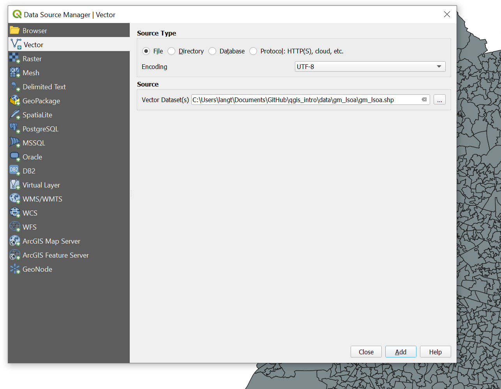
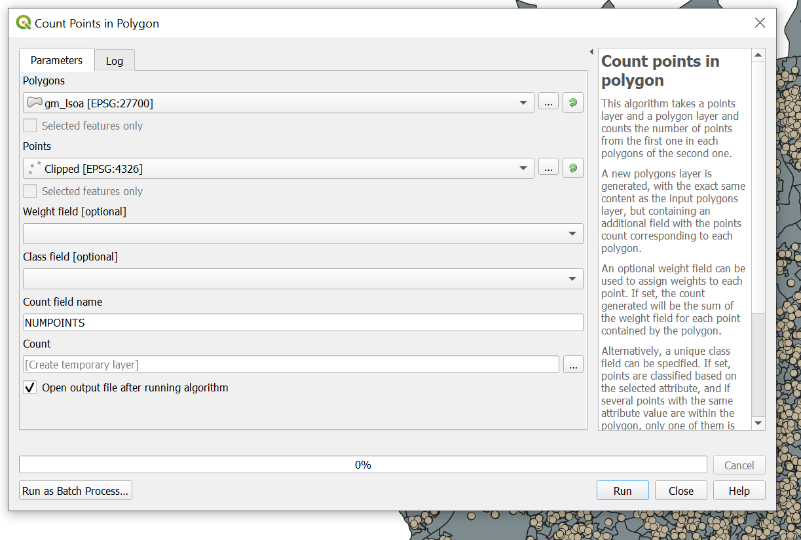
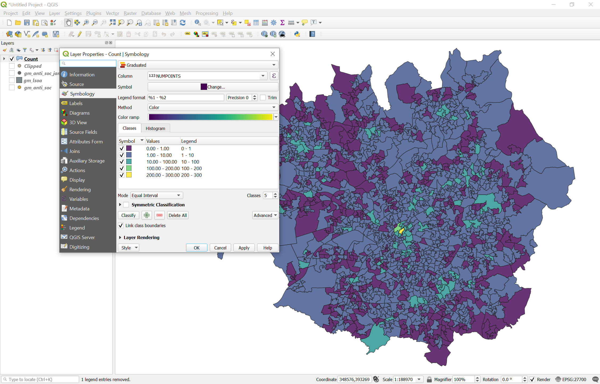
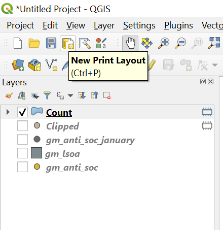
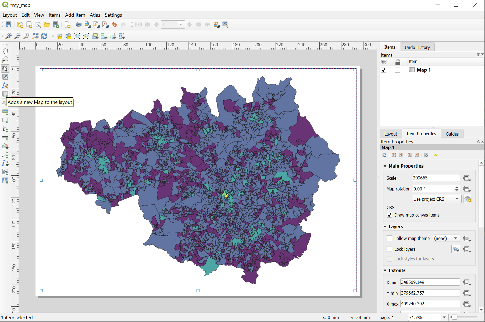
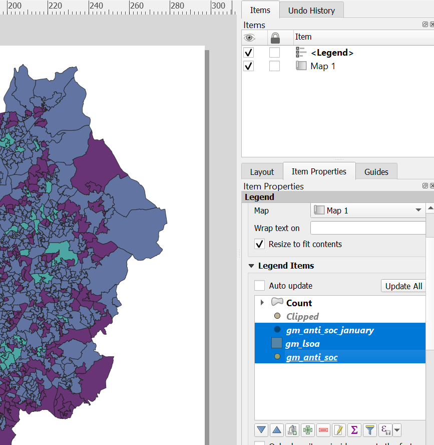
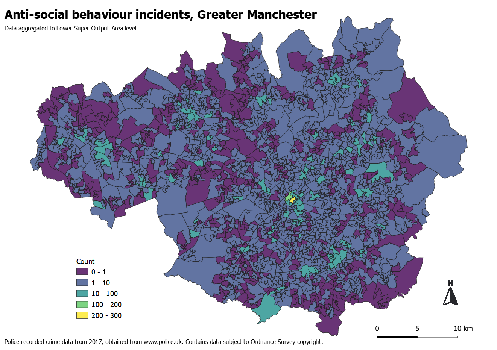

```{r setup, include=FALSE}
knitr::opts_chunk$set(echo = TRUE)
```

# Preamble

This worksheet contains material for an introductory QGIS course held at the [Cathie Marsh Institute for Social Research](https://www.cmi.manchester.ac.uk/) on 26 February 2020. All material is available on [GitHub](https://github.com/langtonhugh/qgis_intro).

# Exercise 2: crime maps

## Raw data

To practice some of what we've learnt so far, and to learn some new skills, we're going to be using some police recorded crime data in Greater Manchester. The data was compiled from an [open data portal](https://data.police.uk/) and contains information about anti-social behaviour incidents recorded by police in Greater Manchester during 2017. [Download this data](https://raw.githubusercontent.com/langtonhugh/qgis_intro/master/data/gm_anti_soc.csv) now as a .csv and save it to a folder on your local machine.

Opening it up in Excel, you will notice that we have the latitude and longitude coordinates of these incidents, the Lower Super Output Area (LSOA) code in which  the incident occurred, the crime type (ASB) and the month. So again, we have a standard spreadsheet containing spatial information (coordinates) and associated attributes of these locations, but it is not being treated as such in Excel. Based on the tram stop data example, you now know how to make this data spatial using the `Layer -> Add Layer -> Add Delimited Text Layer` drop-down menu. This time, however, note that we have latitude and longitude coordinates, **not** eastings and northings. You will need to ensure the CRS is WGS 84 (EPSG 4326) rather than the British National Grid. Remember that latitude is on the Y-axis, and longitude is on the X-axis. Have a go at getting this .csv file into QGIS now, turning those coordinates into vector points, just as we did earlier for tram stops. You should end up with a map something like the one below.

```{r, echo=FALSE, out.width="800px", fig.align="center", fig.cap = "<br> Incident locations of Anti-social behaviour in Greater Machester, 2017."}
knitr::include_graphics("img/gm_points.png")
```

For some of you, the above map might look a bit squished, and you will intuitively know that it does not look right. This could be for a number of reasons. The most common one (for me, anyway) is because the latitude and longitude coordinates are the wrong way around! Another common reason is because that QGIS is automatically trying to project your data 'on the fly'. It does this to help you, and to ensure that it's difficult to work with multiple layers of data in the wrong projection, but it can also be a bit confusing. You can see in the above screenshot, for example, that my QGIS is actually using the BNG (EPSG 27700), stated in the bottom right of the interface. It's like that because I just finished working with the tram data, which was BNG. You can change the CRS of your whole project by clicking on this tab and selecting (in this case) between WGS 84 and BNG as appropriate. If your map looks a bit dodgy, try doing this to resolve it. A good way check what you've done is by using the Open Street Map layer again. If you are working with data from the British Isles, I would recommend sticking to the BNG.

## Expressions

We have lots of data here, perhaps a bit too much. If we were only interested in one issue, let's say ASB incidents that occurred in January, we can subset our data according to a condition within QGIS. You can do this within our attribute table. Open your attribute table up as we did earlier, using the tab at the top of the interface. This will open up a table, and we can see that we have over 80,000 rows (i.e. observations, ASB incidents, points) in our data. There are a number of useful tabs at the top of this window. We can select specific rows, and then zoom to them on our map, for example. What we are interested in is `Select features using an expression`. This brings up a rather unfriendly looking window, but it is a powerful one. You don't need to be completely familiar with how these expressions work, but it's useful to know some basic syntax. For example, to only select ASB incidents which occurred in January, we can write `"month" = '2007-01'` where _month_ is the variable and _2007-01_ is the category we want.

```{r, echo=FALSE, out.width="600px", fig.align="center", fig.cap = "<br> Subset your data by those incidents that occurred in January."}
knitr::include_graphics("img/expression.png")
```

<br>

When you now click on `Select features`, and return to your map view, QGIS will have selected only those incidents that occurred in January, and highlighted them in yellow. We can now save this selection, and add it as a new layer, by right-clicking on the layer and exporting the selection.

```{r, echo=FALSE, out.width="500px", fig.align="center", fig.cap = "<br> Save a selection and create a new layer."}
knitr::include_graphics("img/save_selected.png")
```

<br>

This brings up a window in which you must select where you'd like the data to be saved and what to call it, along with a number of other options, such as whether to save it with a CRS, and whether to add it to your current map view. You will notice that the data format is an [ESRI Shapefile](https://doc.arcgis.com/en/arcgis-online/reference/shapefiles.htm), a popular format for storing vector data like this, which we discussed a little earlier today. You can leave most of these sections untouched, but make sure you select a file location and ensure you have ticked `Add saved file to map`, like the example below.

<br>

```{r, echo=FALSE, out.width="500px", fig.align="center", fig.cap = "<br> Options when save a new layer."}
knitr::include_graphics("img/save_window.png")
```

<br>

Once you save it, a new layer will appear in your interface containing only points of ASB incidents which occurred in January. We are going to use this layer going forward, so to maintain focus, you can untick the original layer in the **Layer** window, and it will be hidden from view.

When faced with so many points, even with this subset, a useful way of exploring the data is to make them transparent, which might show points which overlap. To do this, we can use the `Preferences...` of your layer, and the symbology option, as we explored earlier. Change the `Opacity` slider to make your points more transparent. You might want to change the colour and size of your points whilst you're here, it's up to you.

```{r, echo=FALSE, out.width="500px", fig.align="center", fig.cap = "<br> Options when save a new layer."}
knitr::include_graphics("img/opacity.png")
```

<br>

As you'll see, some points are completely transparent whilst others appear to be opaque because so many points are overlapping. This is because crime locations in open crime data have been 'snapped' to a grid, in order to anonymise the locations. If you feel like exploring this more, try using the `Point diplacement` option from the drop-down symbology menu. Either way, going forward we might want to consider aggregating these points to areal units, such as neighbourhoods. So, instead of lots of points, we have polygons (see description of vector data from earlier!) which have associated attribute data about the number of ASB incidents which occurred within each boundary. First, let's load in some of this data.

## Load vector polygons

So far, we've been creating spatial data from coordinates, but a great deal of information is already 'spatial' when you download it. For example, census neighbourhood boundaries released by the [UK Data Service](https://census.ukdataservice.ac.uk/get-data/boundary-data.aspx) can be downloaded as shapefiles. We are going to use Lower Super Output Areas (LSOA) in Greater Manchester, which roughly equate to a definition of a neighbourhood, each of which contain around 1500 residents. [Download](https://github.com/langtonhugh/qgis_intro/raw/master/data/gm_lsoa.zip) and save this data to your local machine now, and unzip it. It will contain your spatial data about LSOA boundaries (.shp), information about any projections (.prj), the attribute data associated with each LSOA (.dbf) and a final file (.shx) which you don't need to worry about too much, it just speeds things up for us.

To load in this vector polygon data about LSOA neighbourhoods in Greater Manchester, we are going use the `Add Layer` drop-down menu again, but this time select `Add vector layer`. After clicking on the file tab `...`, navigate to your unzipped folder and select **gm_lsoa.shp**, which contains our vector polygons. After clicking on `Add` the layer will be added to your interface. It might end up obscuring your ASB point locations, but you can rearrange these layers in the **Layer** window to put the points on top just by clicking and dragging each layer name.

```{r, echo=FALSE, out.width="600px", fig.align="center", fig.cap = "<br> Loading in your polygon vectors of LSOA in Greater Manchester."}

```

<br>

You will notice that there are actually one or two points outside of the Greater Manchester boundaries in the north west. To get rid of these, we can use what is called a 'spatial clip'.

## Clipping

Clipping is useful because it allows you to subset your data based on the degree of spatial overlap or difference between two different layers, one being a set of points, and the other being a set of polygons. A clip is just one of many 'geoprocessing' tools available in QGIS. Navigate to this option now by clicking on `Vector -> Geoprocessing tools -> Clip` using the drop-down menus at the top of the interface. Your input layer is the points you want to clip, and the overlay layer is the polygons which define the clipped area. You'll notice that in the below window, my two layers are actually projected differently: we are only getting away with this because QGIS is ensuring that our two layers are being projected identically, as per the CRS stated in the bottom right of the interface (in my case the BNG, EPSG 27700). Clicking `Run` will execute the clip. It may take a few minutes!

```{r, echo=FALSE, out.width="600px", fig.align="center", fig.cap = "<br> Selecting the points to clip by a polygon layer. Note the different CRS."}
knitr::include_graphics("img/clip_window.png")
```

<br>

Doing this will create a temporary layer (identified by the symbol next to the layer name), but you may save it if you'd like by right clicking on the layer and selecting `Export -> Save Features As`. Either way, we now have a layer called _Clipped_ which only contains ASB incidents within Greater Manchester. To aggregate these points to our LSOA units, we need to conduct an spatial aggregation.

## Aggregating points to polygon

Counting points in a polygon is a common form of exploratory analysis or descriptive visual. This decision should not be taken lightly, because by aggregating points to polygons, you are losing some level of detail in the data, but in cases like this, it can be very useful. We can navigate to this tool by using `Vector -> Analysis Tools -> Count Points in Polygon` on the top drop-down menus. This brings up a series of options which we can more or less keep as default. The polygons are our LSOA boundaries, in my case called **gm_lsoa**, and our points are the clipped layer, in my case called **Clipped**. This process will create an identical layer to **gm_lsoa** (named "Count" by default) but this new layer will have an additional column in our attribute table called _NUMPOINTS_, which tells us how many points were inside each LSOA observation.

```{r, echo=FALSE, out.width="600px", fig.align="center", fig.cap = "<br> Counting points to polygons."}

```

<br>

With this new layer **Clipped** we can now explore the spatial patterning of ASB across LSOA neighbourhoods in Greater Manchester using a thematic map.

## Thematic map

We can create a thematic map of ASB incidents at LSOA-level in Greater Manchester using this newly-created _NUMPOINTS_ variable. The process behind this is very similar to how we coloured in our tram stop points right at the start of today: using layer `Preferences...` and selecting the symbology option. Specifically, because _NUMPOINTS_ is a continuous variable, we need to use the 'Graduated' option from the symbology drop-down menu. Select this variable, a colour scheme, and create a classification which you think accurately represents the underlying data. You can change the automatic classification method using the `Mode` menu. The below example has specified a classification manually my double-clicking on the values and altering them. What do you think of this classification? Is it reasonable? You can explore the distribution of the variable using the `Histogram` tab, which might give you ideas about how to best segment your data.

```{r, echo=FALSE, out.width="900px", fig.align="center", fig.cap = "<br> Thematic map of ASB counts at LSOA-level with a manual classification."}

```

<br>

This helps identify particularly problematic areas, such as the city centre of Manchester, without being concerned about 'unknown' or misleading clusters due to points overlapping. If you'd like, try adding an additional layer to this visualisation, such as the raw points, displaced point symbols, or an OSM layer. You could even add the tram data from earlier to explore whether ASB incidents tend to cluster around tram stops. 

## Saving maps

This all very nice, but how can you save this map? QGIS has a useful in-built tool which lets you export maps as high-definition visuals. You can also add things like a legend, scale bar and north arrow using this tool. It's referred to as the `Print layout` and you can open a new one using the icon in the tool bar. You will need to give your session a name when you open it, then click OK.

```{r, echo=FALSE, out.width="300px", fig.align="center", fig.cap = "<br> Print Layout icon for exporting saved maps."}

```

<br>

There are endless options within the Print Layout, but let's cover a few of the key ones. First, ensure that your Map View is centred on your visualisation. Go back to our main interface and check this by right-clicking on the layer name and selecting `Zoom to layer`. Returning to your Print Layout, click on `Add a new Map to the layout` on the left-hand tool bar. Click and drag a box which will contain the map across the whole page. You can see that the panel on the right shows what items you've added to the page.

```{r, echo=FALSE, out.width="900px", fig.align="center", fig.cap = "<br> Add a new map to your Print Layout, and drag it across the blank page."}

```

<br>

To add a legend, find the `Add a new Legend to the layout` on the left-hand tool bar. Again, click and drag where you'd like it to go. By default, the legend will include all the layers you have loaded in QGIS. To override this, select the legend item in the right-hand panel, and click on the `Item Properties` tab, untick the `Auto update` box, and then remove the unwanted layers by selecting them and clicking the red minus symbol. You will likely only want to keep the **Count** category on the legend. Within this tab, you can also edit the legend title, font style and font size, along with a host of other features.

<br>

```{r, echo=FALSE, out.width="600px", fig.align="center", fig.cap = "<br> Removing legend categories using the item properties tab in Print Layout."}

```

<br>

You can add a scale bar using the `Add a new Scale Bar to the layout` in the same manner as the other features above (i.e. click and drag). Within `Item Properties` you can change the length, height, font and number of segments in the scale bar. The north arrow tends to be added as an image using the `Add a new Picture to the layout` tab, so find one that you like, save it to your machine, and add it to your layout. Finally, to add a title, you can use the `Add new a Label to the layout` tab (you get the idea by now!). Again, the `Item Properties` allow you to change things like the font size and type. The properties of each item can be a little tricky to figure out: it will take some degree of trial and error, which is why there is no step-by-step guide here. Once you've got the hang of it, you'll be able to add these features to your layout quite easily. The following map might give you some ideas, but feel free to be more creative, and to try different designs out. 

```{r, echo=FALSE, out.width="800px", fig.align="center", fig.cap = "<br> Example of the crime map designed in the Print Layout."}

```

<br>

There are a variety of different ways you can now export this image to your local machine, but a common one will be via the `Export as image` icon in the top tool bar, for things like PNG formats. This will give you a few options, such as the page dimensions and DPI (resolution), but you can also export as an SVG (good for web pages) and PDF files.

And there you have it! If you have followed this exercise from the very beginning you have learnt a whole host of skills. You've converted a mundane spreadsheet into vector point data of anti-social behaviour incidents in Greater Manchester. You loaded in vector polygon data of neighbourhoods, clipped the points to the boundaries of the region, aggregated the data to a census block unit, and then created a thematic map visualising the distribution.

# Exercise 3: various

Now that you have got some fundamental skills down in QGIS, it is time for you to go free and explore some data! The purpose of this is to get you answering your own research questions using spatial data in QGIS. You can do this in a number of ways:

### GM demographics

The LSOA polygon data that we used in Exercise 2 contains a number of additional variables which describe the resident demographic characteristics of each neighbourhood in Greater Manchester. These include:

- **IMDscore**       Index of Multiple Deprivation score for 2019.
- **IMDrank**        Rank of the LSOA in terms of deprivation for England.
- **IMDdeci**        Deprivation decile for England (1-most deprived, 10-least deprived)
- **incscore**       Income score of residents, a component of the IMD.
- **pop_2011**       Resident population at the 2011 census.
- **pop_2018**       Estimated resident population in 2018.

Use the skills you've learnt so far to create some new maps which describe these resident populations, such as the distribution of neighbourhood deprivation deciles. You could even create new variables using expressions, such as a variable representing the population change between 2011 and 2018. A good way to learn the Print Layout tool is to arrange a number of different maps onto one page, in a poster-style 'factsheet' for Greater Manchester.

### Own data

Use QGIS to explore some data from your own research projects. This could be raw data which you've collected yourself, data from a colleague, or data downloaded from the web. If you have an idea for a project, but you're not sure about the data availability or requirements, please do ask me!

### Other!

Make use of the data resources in the following section, or other resources you find online. Choose something you are interested in, and write down some research questions you'd like to answer using the data. The best way to learn QGIS is to have an end goal in mind, such as an answer to a question (e.g. "where are the most deprived areas in England?") and work to achieve it. Let me know if you'd like any guidance!

# Data resources

### CDRC

One of the best online resources for spatial data in the UK is from the Consumer Data Research Centre (CDRC). They release hundreds (thousands) of data sets, often in shapefile format, which we've been using today, on a variety of data, from electoral results to demographic characteristics of regions and neighbourhoods. You can [search](https://data.cdrc.ac.uk/) their database online. In particular, look out for the green 'Open' symbol and the 'Geodata' packs. The website also has some great [online mapping tools](https://maps.cdrc.ac.uk/#/geodemographics/imde2019/default/BTTTFFT/10/-0.1500/51.5200/) which might give you some ideas!

### UK Data Service

The UK Data Service have a handy [online download tool](https://borders.ukdataservice.ac.uk/easy_download.html), which helps you retrieve various different census geography boundaries, such as the LSOA boundaries we used earlier. It includes very small units, such as Output Areas, but also larger regions like parliamentary constituencies. An interesting feature is that many of these boundaries are historical, going back to the 1980s, so you could look at how boundaries have changed over time.

### Ordnance Survey

The official Ordnance Survey [website](https://www.ordnancesurvey.co.uk/opendatadownload/products.html) has a variety of data available, in both vector and raster data types. It is particularly good if you're interested in UK-wide data on things like green spaces, rivers and infrastructure like roads. It also has base maps similar to our OSM layer from earlier, but in raster format. Ordnance Survey release data on buildings too (outlines as vector polygons), but the best place to download these easily is actually from a [Dropbox](https://www.dropbox.com/sh/kioja4ofr2azihn/AACSCu9nvAG_a-6wiM2y4TF8a?dl=0) shared by Alasdair Rae from the University of Sheffield. You could even combine these building outlines with other data, such as information on [listed buildings](https://data.gov.uk/dataset/722b93f3-75fd-47ce-9f06-0efcfa010ecf/listed-buildings) - this is actually one of the things I did myself when learning QGIS!

### GitHub

You will find that people often host a variety of data on GitHub. One of my favourite resources is a community of people who created shapefiles for Middle Earth, the fictional region in the Lord of the Rings, and made them available on a GitHub [repository](https://github.com/jvangeld/ME-GIS).

### Eurostat 

The website for Eurostat has a dedicated [geospatial section](https://ec.europa.eu/eurostat/web/gisco/overview) of their website, where you can download data on country borders, as well as more specific things such as land usage. Their website also makes for an interesting read more generally: it does a great job of emphasising the importance of geography in official statistics.

### Natural Earth

For worldwide boundaries, roads, railway lines, airports, and time zones, amongst others, the [Natural Earth](https://www.naturalearthdata.com/) data download page is fantastic. It has data in both vector and raster format, if you want to explore one or the other.

### Natural England

Their is an [open data portal](https://naturalengland-defra.opendata.arcgis.com/) for Natural England, which has data on things like nature reserves and woodlands. 

### England and Wales police

The data we used earlier was retrieved from the [open data](https://data.police.uk/) on police recorded crimes in England and Wales. As we found out, the data is actually released in spreadsheets for each police force, but using the skills you picked up today, you can turn these into vector points, and aggregate them to different spatial scales as required.

# Further reading

As we noted at the beginning, today is somewhat of a crash course in QGIS, to help you get started with your own projects. There is plenty more to learn about spatial data, projections and GIS functions more generally. For that, you will have to do a bit of reading. The following are some resources you might find useful:

- A popular 'classic' in GIS is a [book](https://www.wiley.com/en-gb/Geographic+Information+Science+and+Systems%2C+4th+Edition-p-9781119031307) by Paul Longley and colleagues that you should be able to get from any university library.
- A recent overview of GIS has been provided by [Ed Ferrari and Alasdair Rae](https://www.amazon.com/GIS-Planning-Built-Environment-Introduction/dp/1137307153?tag=uuid10-20) which should also be available at university libraries. It is also available fairly cheaply as an e-book.
- A colleague and I wrote a short chapter for SAGE on introducing GIS and geovisual analysis. It is not published yet, but it is available [online](https://www.research.manchester.ac.uk/portal/en/publications/gis-and-geovisual-analysis(6f08f8f5-fb0c-4280-8c82-c8f1b7e02d76).html).
- One of the biggest advocates of QGIS is Alasdair Rae from the University of Sheffield. He shares very cool maps on [Twitter](https://twitter.com/undertheraedar?ref_src=twsrc%5Egoogle%7Ctwcamp%5Eserp%7Ctwgr%5Eauthor), including some interesting data visualisations on topics like deprivation.
- As mentioned earlier, one of the most useful online resources is actually the QGIS [documentation](https://docs.qgis.org/3.4/en/docs/training_manual/introduction/intro.html). It includes practical skills in QGIS but also more general information about GIS.
- Taking your GIS research further, a fantastic domestic conference is [GISRUK](http://gisruk.org/). It is a small but friendly and welcoming conference for GIS users from numerous disciplines. Their website contains conference proceedings of all previous papers.