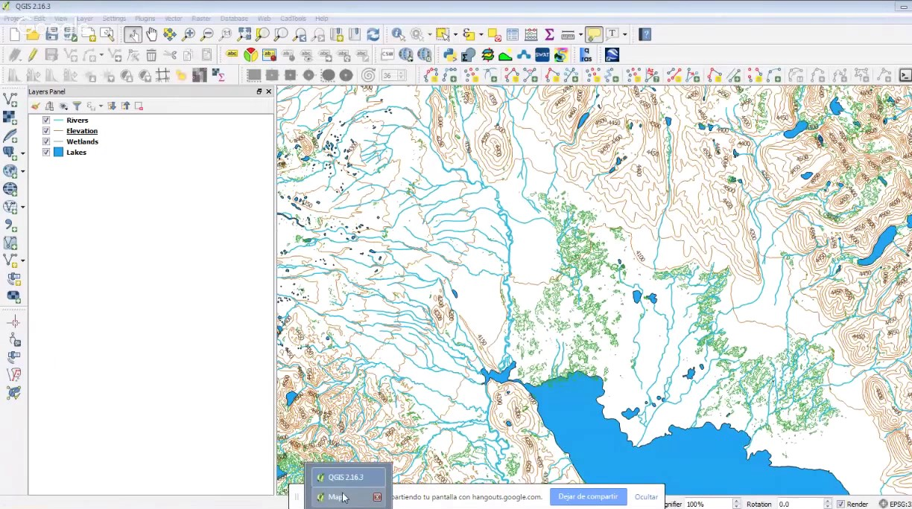
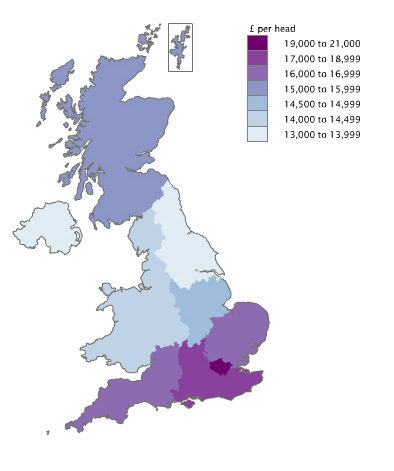
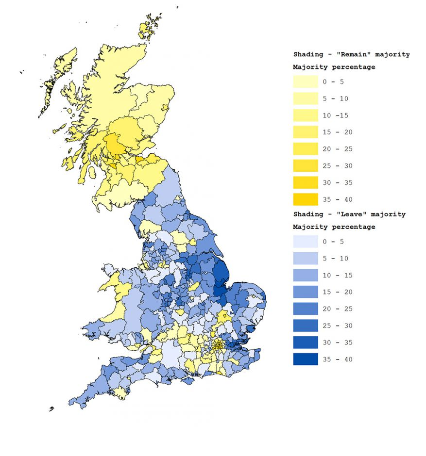
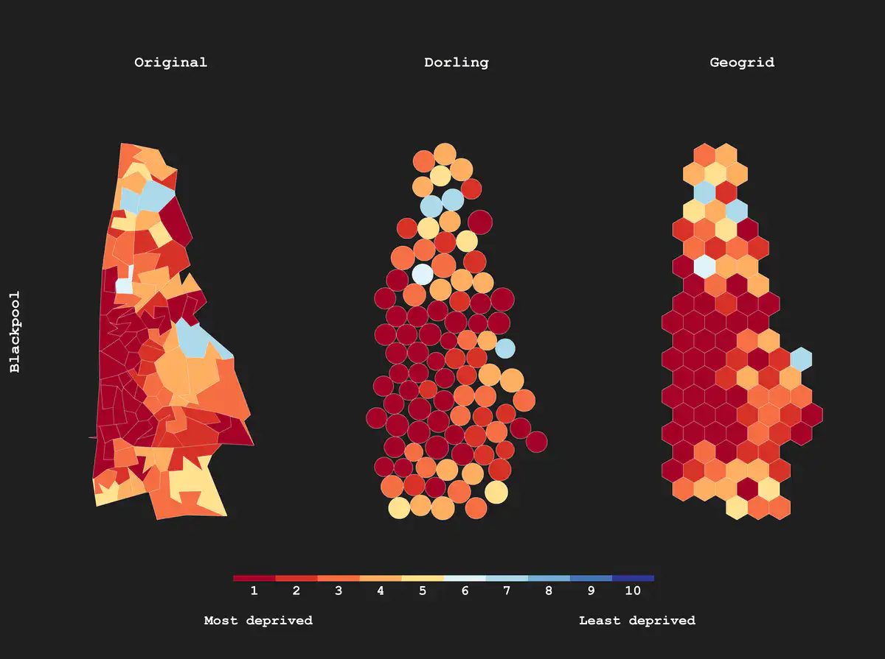
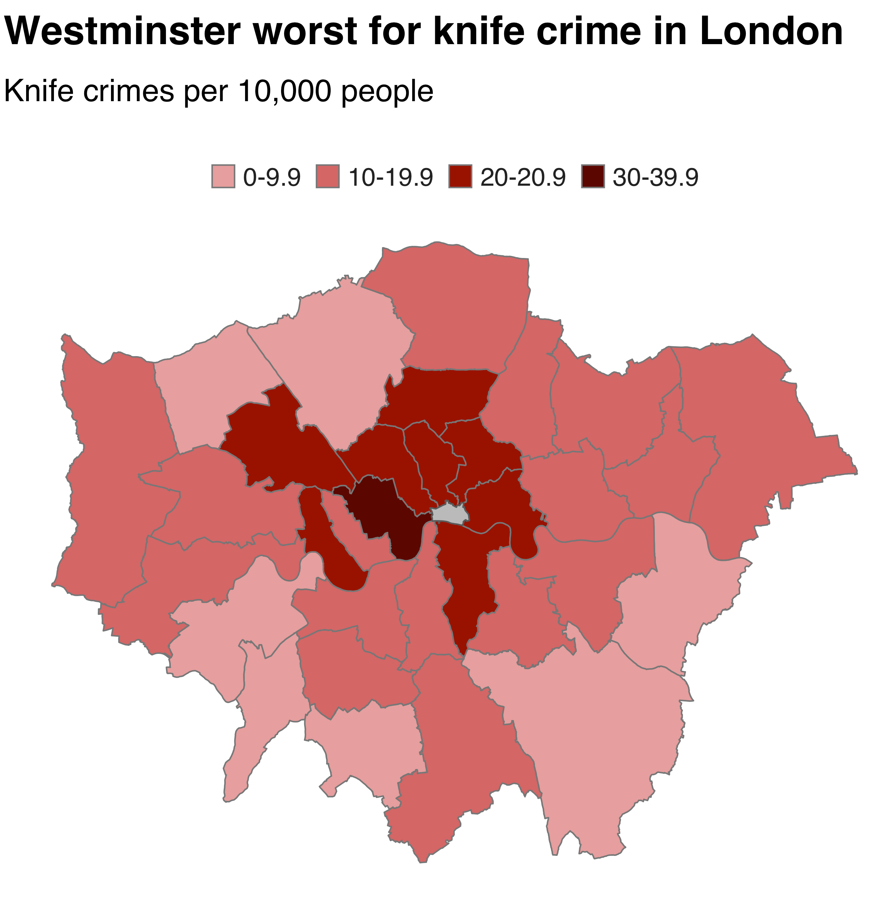
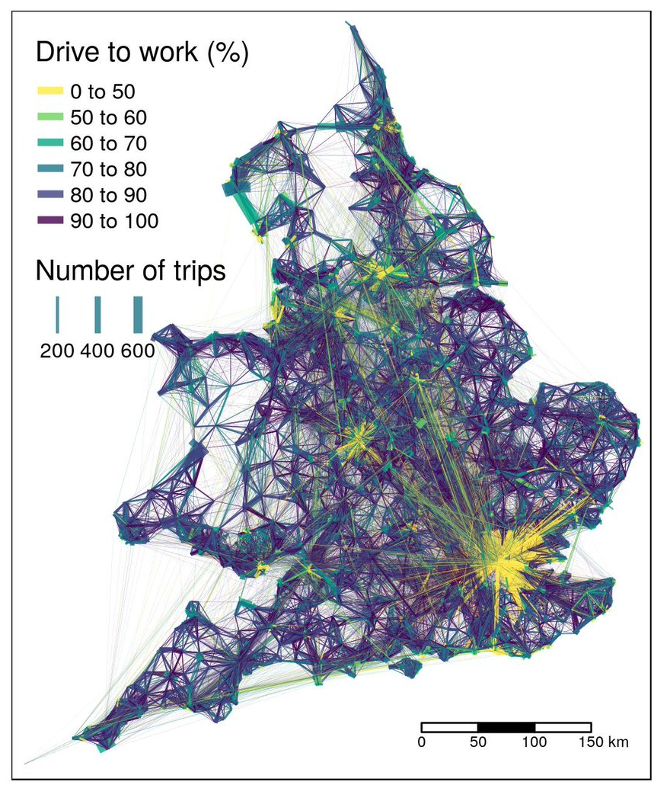
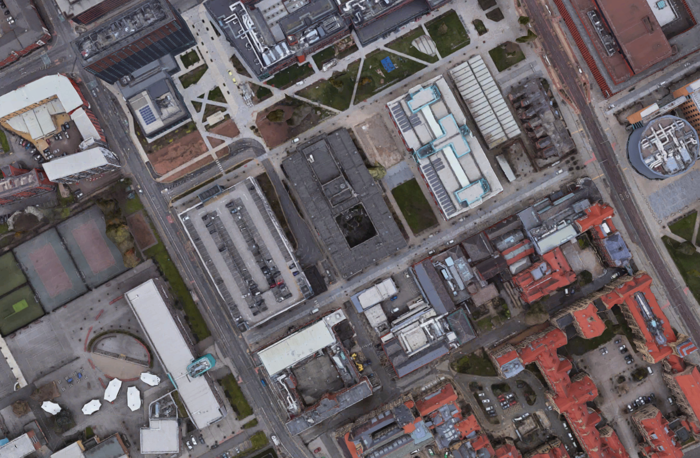
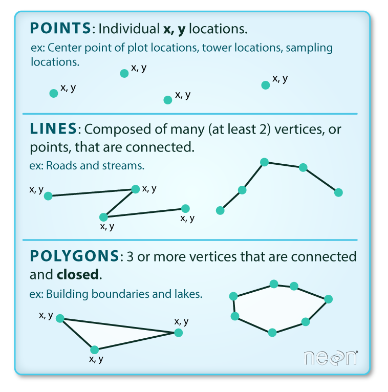
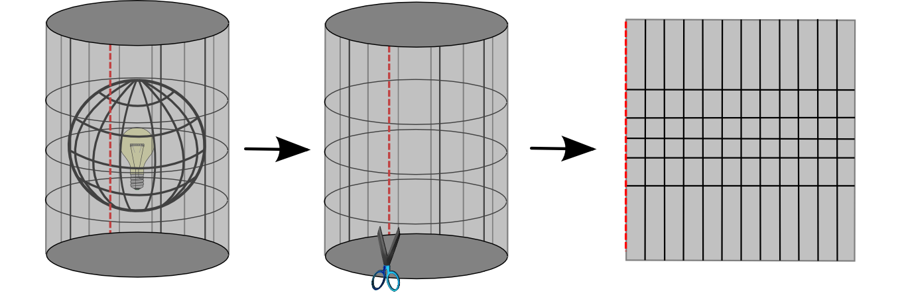

```{r setup, include=FALSE}
knitr::opts_chunk$set(echo = FALSE)
```

## Welcome

```{r, echo=FALSE, out.width="150px"}
knitr::include_graphics("https://pbs.twimg.com/profile_images/866718054989930496/1JnqmEAe_400x400.jpg")
```

Sam Langton

@sh_langton

s.langton@mmu.ac.uk

---

## Welcome

```{r, echo=FALSE, out.width="150px"}
knitr::include_graphics("https://pbs.twimg.com/profile_images/866718054989930496/1JnqmEAe_400x400.jpg")
```

Sam Langton

@sh_langton

s.langton@mmu.ac.uk

<br>

All materials for today are available online:

https://github.com/langtonhugh/qgis_intro/tree/odm_qgis_intro

</br>

---

## What is GIS?

- Geographic Information System (GIS) - **QGIS is one of them!**

---

## What is GIS?

- Geographic Information System (GIS) - **QGIS is one of them!**
- Tool for storing, manipulating, visualising and analysing spatial information.
- You have likely used some form of GIS before online.
- It is an entire field and community.
- Used in [academic](http://gisruk.org/) research, [government](https://mappinggm.org.uk/gmodin/), [charities](https://thirdsectorgeography.com/), military and private sectors.

```{r, echo=FALSE, out.width="550px", fig.align="center"}

```

Source: [Hatari Labs](https://www.youtube.com/watch?v=PZ7oUmD5DnU).

---

## Why use GIS?

<center>

**Many processes and societal outcomes are spatial!**

---

## Why use GIS?

```{r, echo=FALSE, out.width="370px", fig.align="center"}

```

**Regional inequality.** Source: [ONS](https://www.sheffield.ac.uk/news/nr/uk-higher-regional-inequality-large-wealthy-country-1.862262).

---

## Why use GIS?


```{r, echo=FALSE, out.width="400px", fig.align="center"}

```

**Voting behaviour.** Source: [University of Oxford](http://www.ox.ac.uk/news-and-events/oxford-and-brexit/brexit-analysis/mapping-brexit-vote).

---

## Why use GIS?


```{r, echo=FALSE, out.width="600px", fig.align="center"}

```

**Neighbourhood deprivation.** Source: [The Conversation](http://theconversation.com/even-the-most-beautiful-maps-can-be-misleading-126474).

---

## Why use GIS?

```{r, echo=FALSE, out.width="440px", fig.align="center"}

```

**Crime concentrations.** Source: [BBC](https://www.bbc.com/news/uk-england-london-49921421).

---

## Why use GIS?

```{r, echo=FALSE, out.width="400px", fig.align="center"}

```

**Transport.** Source: [Robin Lovelace](hhttps://twitter.com/robinlovelace/status/959853407749246976).

---

## What is QGIS?

<br>

```{r, echo=FALSE, out.width="500px", fig.align="center"}
knitr::include_graphics("img/qgis_logo.png")
```

---

## What is QGIS?

<br>

```{r, echo=FALSE, out.width="500px", fig.align="center"}
knitr::include_graphics("img/qgis_logo.png")
```

<br>

- QGIS is a freely available Geographic Information System (GIS) application.
- Create, handle, edit, analyse and visualise spatial information.

---

## Why use it?

---

## Why use it: open-source

```{r, echo=FALSE, out.width="700px", fig.align="center"}

```

---

## Why use it: open-source

- Free!
- Continuous [development](https://qgis.org/en/site/index.html).
- Community-driven
- Wide functionality
  - Multidisciplinary
  - Cross-platform
  - Data formats

---

## Why use it: community

```{r, echo=FALSE, out.width="700px", fig.align="center"}
knitr::include_graphics("img/community.png")
```

Source: [QGIS user conference 2019](https://2019.qgis.es/)

---

## Why use it: accessibility

```{r, echo=FALSE, out.width="600px", fig.align="center"}

```


---

## GIS fundamentals

<br>

```{r, echo=FALSE, out.width="550px", fig.align="center"}
knitr::include_graphics("img/grom.gif")
```

---

## GIS fundamentals: spatial data

- Spatial data simply represents the real world.
- Describes the location, size and shape of entities.
- Must be quantified for use in GIS.

```{r, echo=FALSE, out.width="600px", fig.align="center"}

```

---

## GIS fundamentals: _vector_ spatial data

```{r, echo=FALSE, out.width="450px", fig.align="center"}

```

Source: [Data Carpentry](https://datacarpentry.org/organization-geospatial/02-intro-vector-data/). 

---

## GIS fundamentals: _vector_ spatial data

```{r, echo=FALSE, out.width="700px", fig.align="center"}
knitr::include_graphics("img/lotr.png")
```

---

## GIS fundamentals: projections & CRS

- Maps tend to represent the (~spherical) earth on flat surfaces (e.g. paper, screens).
- This transformation is known as a [projection](https://docs.qgis.org/testing/en/docs/gentle_gis_introduction/coordinate_reference_systems.html).
- Be aware of the Coordinate Reference System (CRS).
- Geographic CRS (e.g. [WGS 84](https://en.wikipedia.org/wiki/World_Geodetic_System)).
- Projected CRS (e.g. [British National Grid](https://www.ordnancesurvey.co.uk/documents/resources/guide-to-nationalgrid.pdf)).

<br>

```{r, echo=FALSE, out.width="600px", fig.align="center"}

```

Source: [QGIS documentation](https://docs.qgis.org/testing/en/docs/gentle_gis_introduction/coordinate_reference_systems.html).

---


## Live demo

```{r, echo=FALSE, out.width="700px", fig.align="center"}

```

---

## Extras

---

## GIS fundamentals: data formats

- Today, we will use shapefiles (`.shp`).
- Shapefiles are a popular format to store geospatial vector data.
- Unlike standard 2D data frames, such as .csv files, shapefiles contains multiple components.
  - `.shp`
  - `.dbf`
  - `.prj`
  - `.shx`
- But there are other formats, such as _.geojson_ or _kml_, which you might come across.
- There is some [debate](https://gis.stackexchange.com/questions/64909/which-data-formats-are-best-for-open-data-distribution) over the most appropriate, with each having their own advantages and disadvantages.

